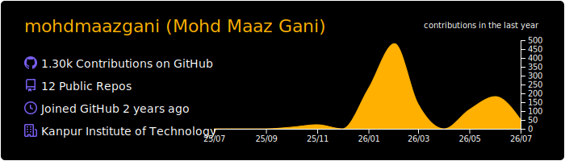
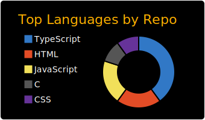
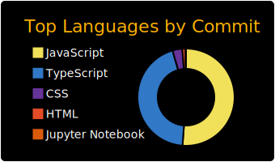
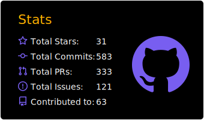
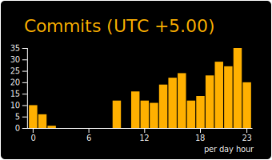

<div align="center">


<p>
  
</p>

<p>
  <a href="https://linkedin.com/in/mohd-maaz-gani/"></a>&nbsp;
  <a href="mailto:mohdmaazgani@gmail.com"></a>&nbsp;
  <a href="https://github.com/mohdmaazgani"></a>
</p>


</div>

---

## 🧑‍💻 About Me

```python
class MohdMaazGani:
    def __init__(self):
        self.name       = "Mohd Maaz Gani"
        self.location   = "India 🇮🇳"
        self.role       = "Full Stack Developer & AI Enthusiast"
        self.languages  = ["Python", "JavaScript", "Java", "C++", "TypeScript"]
        self.interests  = ["Web Dev", "Machine Learning", "DSA", "Open Source"]
        self.currently  = "Mastering DSA + diving into Flask/Django 🌱"
        self.fun_fact   = "I turn caffeine ☕ and code into AI-powered solutions 🚀"

    def say_hi(self):
        print("Thanks for stopping by! Let's build something awesome together.")

me = MohdMaazGani()
me.say_hi()
```

---

## 🚀 Tech Stack

### 💬 Languages
<p>
  
  
  
  
  
  
</p>

### 🌐 Frontend
<p>
  
  
  
  
  
  
  
  
</p>

### ⚙️ Backend & Databases
<p>
  
  
  
  
  
  
  
  
</p>

### 🤖 AI / ML
<p>
  
  
  
  
  
  
</p>

### ☁️ DevOps & Tools
<p>
  
  
  
  
  
  
  
</p>

---

## 📊 GitHub Stats

<div align="center">
  
</div>

<div align="center">
  
</div>

<div align="center">
  
  
  
</div>

<div align="center">
  
</div>

---

## 📈 Contribution Graph

<div align="center">
  
</div>

---

## 🔥 Streak

<div align="center">
  
</div>

---

## 🎖️ Holopin Badges

<div align="center">
  <a href="https://holopin.io/@mohdmaazgani">
    
  </a>
</div>

---

## 💡 A Random Dev Quote

<div align="center">
  
</div>

---

<div align="center">
  
</div>

<div align="center">
  <i>⚡ "If you've landed here, either fate has a great sense of humor… or you're exactly where you're meant to be. Welcome! 😄"</i>
  <br><br>
  <b>📫 Let's build something cool → <a href="mailto:mohdmaazgani@gmail.com">mohdmaazgani@gmail.com</a></b>
</div>

---

